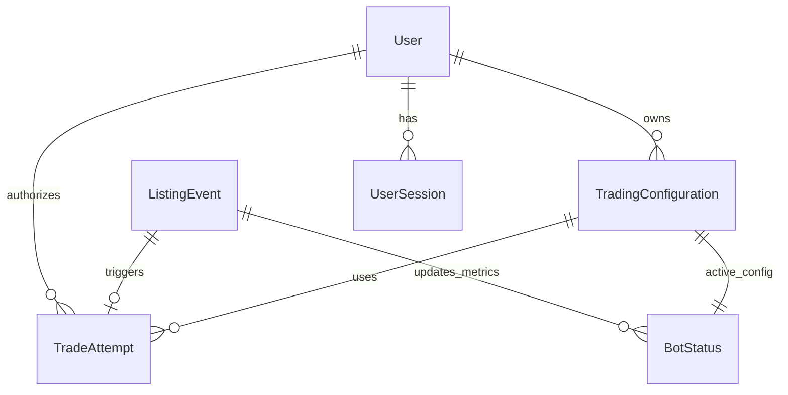

# Data Model: MEXC Sniper Bot AI

**Purpose**: Entity definitions and relationships for the trading system
**Created**: 2025-01-06
**Feature**: [spec.md](./spec.md)

## Core Entities

### Trading Configuration
**Purpose**: User-defined trading parameters and limits

```typescript
interface TradingConfiguration {
  id: string;                    // UUID primary key
  userId: string;                // User identifier (future multi-user support)
  
  // Trading Parameters
  enabledPairs: string[];        // Target coin pairs (e.g., ["BTC/USDT", "ETH/USDT"])
  maxPurchaseAmount: number;     // Maximum USDT amount per trade
  priceTolerance: number;        // Maximum price deviation tolerance (percentage)
  
  // Risk Management
  dailySpendingLimit: number;    // Maximum daily trading volume
  maxTradesPerHour: number;      // Rate limiting for protection
  
  // Timing Configuration
  pollingInterval: number;       // MEXC API polling interval (milliseconds)
  orderTimeout: number;          // Order execution timeout (milliseconds)
  
  // Metadata
  createdAt: Date;
  updatedAt: Date;
  isActive: boolean;             // Enable/disable trading
}
```

**Validation Rules**:
- `maxPurchaseAmount` must be > 0 and ≤ `dailySpendingLimit`
- `priceTolerance` must be between 0.1% and 50%
- `pollingInterval` must be ≥ 1000ms (to respect rate limits)
- `orderTimeout` must be ≥ 5000ms

### Listing Event
**Purpose**: Detected new token listings from MEXC

```typescript
interface ListingEvent {
  id: string;                    // UUID primary key
  symbol: string;                // Trading pair symbol (e.g., "NEW/USDT")
  exchangeName: string;          // "MEXC"
  
  // Listing Details
  listingTime: Date;             // When the listing was detected
  baseAsset: string;             // Base currency (e.g., "NEW")
  quoteAsset: string;            // Quote currency (e.g., "USDT")
  status: ListingStatus;         // Active monitoring status
  
  // Market Data
  initialPrice?: number;         // First detected price
  currentPrice?: number;         // Latest price snapshot
  priceChange24h?: number;       // 24-hour price change percentage
  
  // Processing State
  processed: boolean;            // Whether trade execution was attempted
  tradeAttemptId?: string;       // Reference to trade attempt
  
  // Metadata
  detectedAt: Date;              // System detection timestamp
  expiresAt: Date;               // When to stop monitoring this listing
}
```

**Validation Rules**:
- `symbol` must match MEXC trading pair format
- `listingTime` cannot be in the future
- `expiresAt` must be after `listingTime`
- `priceTolerance` validation applies when processing trades

### Trade Attempt
**Purpose**: Complete record of each trading action

```typescript
interface TradeAttempt {
  id: string;                    // UUID primary key
  listingEventId: string;        // Reference to the listing event
  configurationId: string;       // Configuration used for this trade
  
  // Order Details
  symbol: string;                // Trading pair
  side: "BUY";                   // Always BUY for sniper bot
  type: "MARKET" | "LIMIT";      // Order type
  quantity: number;              // Amount of base asset to buy
  price?: number;                // Price (for LIMIT orders)
  
  // Execution Results
  status: TradeStatus;           // Final execution status
  orderId?: string;              // MEXC order ID if accepted
  executedQuantity?: number;     // Actually filled amount
  executedPrice?: number;        // Average execution price
  commission?: number;           // Trading fee paid
  
  // Timing Information
  detectedAt: Date;              // When listing was detected
  submittedAt: Date;             // When order was submitted to MEXC
  completedAt?: Date;            // When order was filled/cancelled
  
  // Error Information
  errorCode?: string;            // MEXC API error code
  errorMessage?: string;         // Human-readable error message
  retryCount: number;            // Number of retry attempts
  
  // Metadata
  createdAt: Date;
  configurationSnapshot: object; // Config snapshot at time of trade
}
```

**Validation Rules**:
- `quantity` must be > 0
- `submittedAt` must be after `detectedAt`
- `completedAt` must be after `submittedAt` if present
- `retryCount` must be ≥ 0

### Bot Status
**Purpose**: Current operational state and health metrics

```typescript
interface BotStatus {
  id: string;                    // UUID primary key (singleton record)
  
  // Operational State
  isRunning: boolean;            // Whether monitoring is active
  lastHeartbeat: Date;           // Last system heartbeat
  
  // API Connectivity
  mexcApiStatus: ApiStatus;      // MEXC API connectivity status
  lastApiCheck: Date;            // Last API connectivity test
  apiResponseTime: number;       // Current API response time (ms)
  
  // Performance Metrics
  listingsDetected24h: number;   // Listings detected in last 24 hours
  tradesExecuted24h: number;     // Successful trades in last 24 hours
  averageExecutionTime: number;  // Average trade execution time (ms)
  
  // Error Tracking
  consecutiveErrors: number;     // Current error streak
  lastErrorAt?: Date;            // Last error timestamp
  lastErrorMessage?: string;     // Last error message
  
  // Configuration
  currentConfigurationId: string; // Active configuration
  configurationVersion: number;  // Version of active config
  
  // Metadata
  updatedAt: Date;
}
```

**Validation Rules**:
- `lastHeartbeat` cannot be more than 5 minutes old
- `apiResponseTime` must be > 0
- `consecutiveErrors` must be ≥ 0

### User Session
**Purpose**: Authentication and authorization context

```typescript
interface UserSession {
  id: string;                    // UUID primary key
  
  // Authentication
  userId: string;                // User identifier
  sessionToken: string;          // Session identifier
  expiresAt: Date;               // Session expiration
  
  // Access Control
  permissions: string[];         // Granted permissions
  ipAddress: string;             // Client IP address
  userAgent: string;             // Client user agent
  
  // Activity Tracking
  lastActivityAt: Date;          // Last user action
  loginAt: Date;                 // Session creation time
  
  // Metadata
  createdAt: Date;
  isActive: boolean;             // Session validity
}
```

**Validation Rules**:
- `expiresAt` must be after `createdAt`
- `lastActivityAt` cannot be after current time
- `permissions` must include "dashboard:read" for access

## Enums and Types

```typescript
enum ListingStatus {
  DETECTED = "DETECTED",         // Newly detected, being monitored
  PROCESSING = "PROCESSING",     // Trade execution in progress
  COMPLETED = "COMPLETED",       // Trade executed successfully
  FAILED = "FAILED",             // Trade execution failed
  EXPIRED = "EXPIRED"            // No longer monitoring
}

enum TradeStatus {
  PENDING = "PENDING",           // Submitted to exchange
  FILLED = "FILLED",             // Successfully executed
  PARTIALLY_FILLED = "PARTIALLY_FILLED", // Partial execution
  CANCELLED = "CANCELLED",       // Cancelled by user or system
  REJECTED = "REJECTED",         // Rejected by exchange
  FAILED = "FAILED"              // Failed due to error
}

enum ApiStatus {
  HEALTHY = "HEALTHY",           // API responding normally
  DEGRADED = "DEGRADED",         // Slow response times
  UNAVAILABLE = "UNAVAILABLE",   // API not responding
  RATE_LIMITED = "RATE_LIMITED"  // Rate limit reached
}
```

## Relationships



## Database Schema Considerations

### Indexes for Performance
- `listing_events(symbol, listing_time)` - For active monitoring queries
- `trade_attempts(listing_event_id, created_at)` - For trade history lookups
- `trade_attempts(status, submitted_at)` - For pending order monitoring
- `bot_status(is_running, last_heartbeat)` - For health checks

### Partitioning Strategy
- `trade_attempts` partitioned by month for large historical data
- `listing_events` partitioned by week for automated cleanup

### Data Retention
- Trade attempts: Keep 2 years for compliance
- Listing events: Keep 30 days, then archive
- Bot status: Keep 7 days, then roll up
- User sessions: Keep 30 days for security audit

## State Transitions

### Listing Event Flow
```
DETECTED → PROCESSING → COMPLETED/FAILED → EXPIRED
```

### Trade Attempt Flow
```
PENDING → FILLED/PARTIALLY_FILLED/CANCELLED/REJECTED/FAILED
```

### Bot Status Flow
```
HEALTHY ↔ DEGRADED → UNAVAILABLE → HEALTHY
```

## Validation Summary

All entities include comprehensive validation rules:
- Type safety through TypeScript interfaces
- Business rule enforcement at database level
- Referential integrity through foreign keys
- Audit trails through created/updated timestamps
- Performance optimization through strategic indexing

The data model supports all user stories and success criteria while maintaining constitution compliance.
